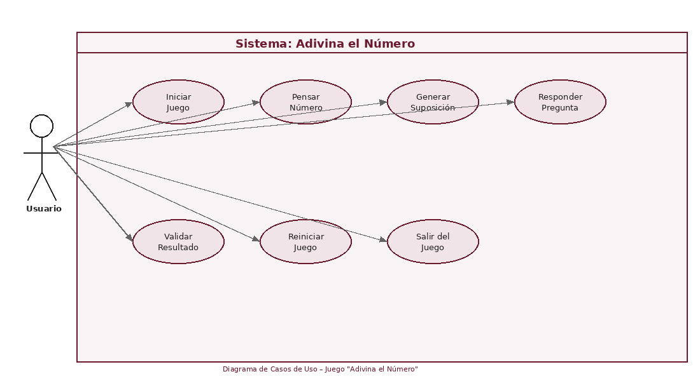
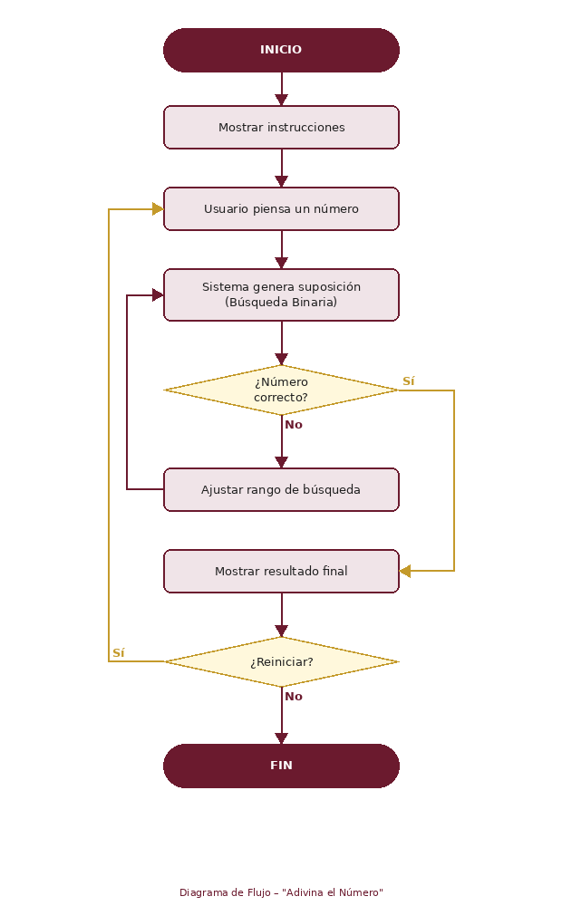
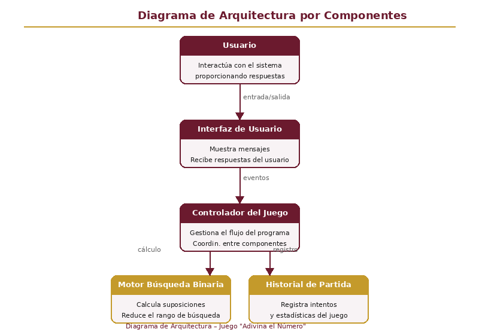

# 🎮 Adivina el Número

> Juego interactivo en Python donde el **computador adivina** el número que el usuario ha pensado, utilizando el algoritmo de **búsqueda binaria**.

---

## 📌 Información del proyecto

| Campo | Detalle |
|---|---|
| **Estudiante** | Victor Ariel Umatambo Llumiquinga |
| **Materia** | Lógica de Programación |
| **Universidad** | UIDE – Universidad Internacional del Ecuador |
| **Lenguaje** | Python 3 |
| **Interfaz** | Consola / Terminal |

---

## 🧠 ¿Cómo funciona?

El usuario **piensa** un número entre 1 y 100. El sistema lo adivina realizando preguntas sucesivas usando **búsqueda binaria**: en cada intento divide el rango a la mitad, descartando la mitad incorrecta según la respuesta del usuario.

**Complejidad:** O(log₂ n) → máximo **7 intentos** para cualquier número del 1 al 100.

---

## 🗂️ Estructura del repositorio

```
adivina-el-numero/
│
├── adivina.py          # Código principal del juego
├── README.md           # Documentación del proyecto
└── diagramas/
    ├── diagrama_casos_de_uso.png
    ├── diagrama_flujo.png
    └── diagrama_arquitectura.png
```

---

## ▶️ Cómo ejecutar

```bash
# Requisitos: Python 3.x instalado
python adivina.py
```

---

## 🎮 Instrucciones de juego

1. Piensa un número entre **1 y 100**
2. Presiona **ENTER** cuando estés listo
3. El sistema hará una suposición — responde con:
   - **`M`** → Tu número es **Mayor** que la suposición
   - **`m`** → Tu número es **Menor** que la suposición
   - **`C`** → ¡**Correcto**! Ese es tu número

---

## ⚙️ Estructuras implementadas

| Concepto | Uso en el código |
|---|---|
| **Bucle `while`** | Ciclo principal del juego y validación de entradas |
| **Condicionales `if/elif/else`** | Ajuste del rango y validación de respuestas |
| **Funciones** | Código modular y organizado |
| **Búsqueda binaria** | Algoritmo central del sistema |
| **Comentarios** | Documentación en secciones clave |

---

## 📊 Diagramas

### Diagrama de Casos de Uso


### Diagrama de Flujo


### Arquitectura del Sistema


---

## 📁 Actividad académica

Este repositorio corresponde al desarrollo de la actividad **"Aprendizaje Autonomo 2"** de la materia Lógica de Programación – UIDE 2026.
